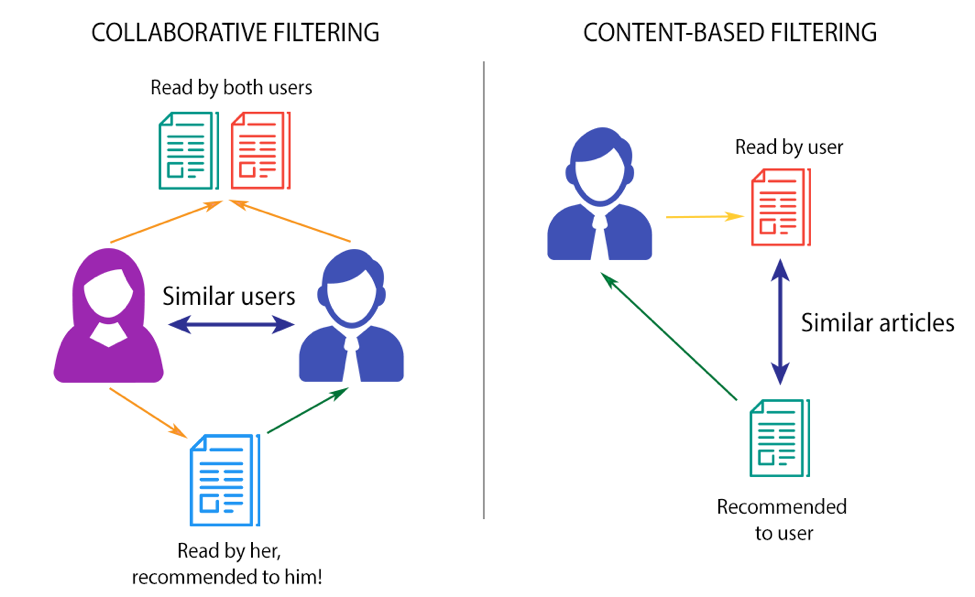
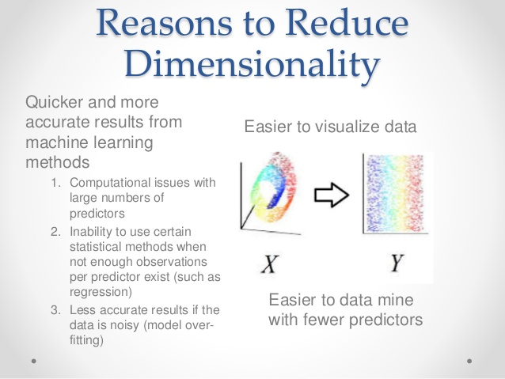
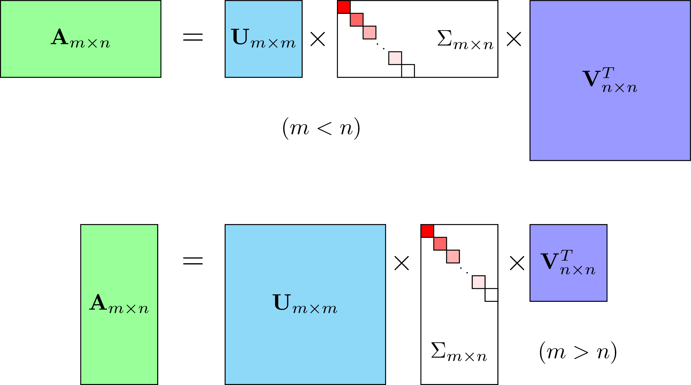

## TZP3 | Increased Performance Hybrid Movie Recommender System 

 

### Overview 
The main objective of this project is to contruct a system to increase performance capability in speed and accuracy updating our [first model](https://columbia.bootcampcontent.com/Zee/movies_rec_project_3) as a starting point. Please note that we are only showing the codes from the improved performances in this repository. For the first part please click on the first model link. 

---
### Project Content
1. Load Data
   1. The Datasets
      1. MovieLens
      2. OMDb
2. Data Preparation - Analysis 
   1. [Movies](https://github.com/zeexav/TZP3/blob/master/testenv/Movies.ipynb)
   2. [Ratings](https://github.com/zeexav/TZP3/blob/master/testenv/Ratings.ipynb)
3. Final Dataset 
4. Build Recommender Systems
   1. Content and Collaborative Filtering `recoSys` 
   2. Implemanting SVD - Singular Value Decomposition `recoSys`
5. Hybrid RecoSys Engine 
---
### 1. Load Data
##### i. The Dataset 
##### a. [MovieLens](https://grouplens.org/datasets/movielens/) 
From MovieLens we decided to utilize the [20M dataset](http://files.grouplens.org/datasets/movielens/ml-20m-READFME.html) wich provided us 20 million ratings and 465,000 tag applications applied to 27,000 movies by 138,000 users.
##### b. [OMDb](http://www.omdbapi.com/)
We decided to utilize two datasets from OMDb, the first contains 17K  movies made from 1990, the second set contains 19K movies made from 2009 to 2018.

### 2. Data Preparation - Analysis
##### i. Movies
In summary OMDd data was gathered by using the movie titles from the MovieLens data set by calling the API. Only movie titles that matched returned information and since API matching isn't higly effective we needed to start a cleaning process to be able to join all the tables in one single data frame. For the whole cleaning process on the movie datasets please click on the link 'movies' under project content.
##### ii. Ratings 
At this stage of the project we utilized the ratings dataset from Movielens which contains approximately 27,000,000 ratings. We first explored the data doing a data analysis in order to decide the best route to take to come up with a final data set to utilize in our models. We tested different sizes on our ML models as we needed to ultimetly decide if we should slipt it based on metric or just randomly select a percentage of the data. 

### 3. Final Dataset 
After few processes of data cleaning and analysis we were able to build our final dataset. in order to build our final dataset we took into consideration our main goal, which is speed and accuracy but we also needed to be mindfull of our computational limitations as we only had our personla computers to work on. 
At first, we explored a hybrid of movie popularity with only users that have rated in between 50 and 150 movies. This process only generated 910 movies. As we were trying to undertand the lower return from our first process, we explored our avalible data further realizing that most of the users rated less than 200 movies. With that in mind we used a variety of ranges in order to come up with a perfect datase for our use. We were able to come up with an ok dataset consideration our limitations and the final dataset has 111102 movies rated by 27585 users. The optimal range ustilized was inbetween 75 and 150. 

### 4. Build Recommender Systems 
##### i. Content and Collaborative Systems 

 

##### [Content-Based](https://github.com/zeexav/TZP3/blob/master/testenv/ContentSys.ipynb) 

Click on the link for our content based recoSys

The Content-Based Recommender relies on the similarity of the items being recommended. The basic idea is that if you like an item, then you will also like a “similar” item. It generally works well when it's easy to determine the context/properties of each item.
A content based recommender works with data that the user provides, either explicitly movie ratings for the MovieLens dataset. Based on that data, a user profile is generated, which is then used to make suggestions to the user. As the user provides more inputs or takes actions on the recommendations, the engine becomes more and more accurate.

##### [Collaborative Filtering](https://columbia.bootcampcontent.com/Zee/movies_rec_project_3/blob/master/testingEnv/MovieRecoSys.ipynb)

Clink on the link for our Collaborative Filtering recoSys. Please note that teh system was build in the first part of this project and you will be redirected to our repository in gitlab. 

The Collaborative Filtering Recommender is entirely based on the past behavior and not on the context. More specifically, it is based on the similarity in preferences, tastes and choices of two users. It analyses how similar the tastes of one user is to another and makes recommendations on the basis of that.
For instance, if user A likes movies 1, 2, 3 and user B likes movies 2,3,4, then they have similar interests and A should like movie 4 and B should like movie 1. This makes it one of the most commonly used algorithm as it is not dependent on any additional information.
In general, collaborative filtering is the workhorse of recommender engines. The algorithm has a very interesting property of being able to do feature learning on its own, which means that it can start to learn for itself what features to use. It can be divided into Memory-Based Collaborative Filtering and Model-Based Collaborative filtering. In this post, I'll only focus on the Memory-Based Collaborative Filtering technique.

##### ii. [Implementing SVD - Singular Value Decomposition](https://github.com/zeexav/TZP3/blob/master/testenv/Ratings.ipynb)

Click on the link for our repository. 

 

Model-based Collaborative Filtering is based on matrix factorization (MF) which has received greater exposure, mainly as an unsupervised learning method for latent variable decomposition and dimensionality reduction. Matrix factorization is widely used for recommender systems where it can deal better with scalability and sparsity than Memory-based CF:

The goal of MF is to learn the latent preferences of users and the latent attributes of items from known ratings (learn features that describe the characteristics of ratings) to then predict the unknown ratings through the dot product of the latent features of users and items.
When you have a very sparse matrix, with a lot of dimensions, by doing matrix factorization, you can restructure the user-item matrix into low-rank structure, and you can represent the matrix by the multiplication of two low-rank matrices, where the rows contain the latent vector.
You fit this matrix to approximate your original matrix, as closely as possible, by multiplying the low-rank matrices together, which fills in the entries missing in the original matrix.

##### SVD 

A well-known matrix factorization method is Singular value decomposition (SVD). At a high level, SVD is an algorithm that decomposes a matrix A into the best lower rank (i.e. smaller/simpler) approximation of the original matrix A. Mathematically, it decomposes A into a two unitary matrices and a diagonal matrix:

 

where A is the input data matrix (users's ratings), U is the left singular vectors (user "features" matrix), Σ is the diagonal matrix of singular values (essentially weights/strengths of each concept), and VT is the right singluar vectors (movie "features" matrix). U and VT are column orthonomal, and represent different things. U represents how much users "like" each feature and VT represents how relevant each feature is to each movie.

To get the lower rank approximation, I take these matrices and keep only the top k features, which can be thought of as the underlying tastes and preferences vectors.

### 5. [Hybrid RecoSys Engine](https://github.com/zeexav/TZP3/blob/master/testenv/Hybrid.ipynb)

Click on the link for our repository. 

Welcome to the last part of the project. Here we were able to join both systems combining both features. 

